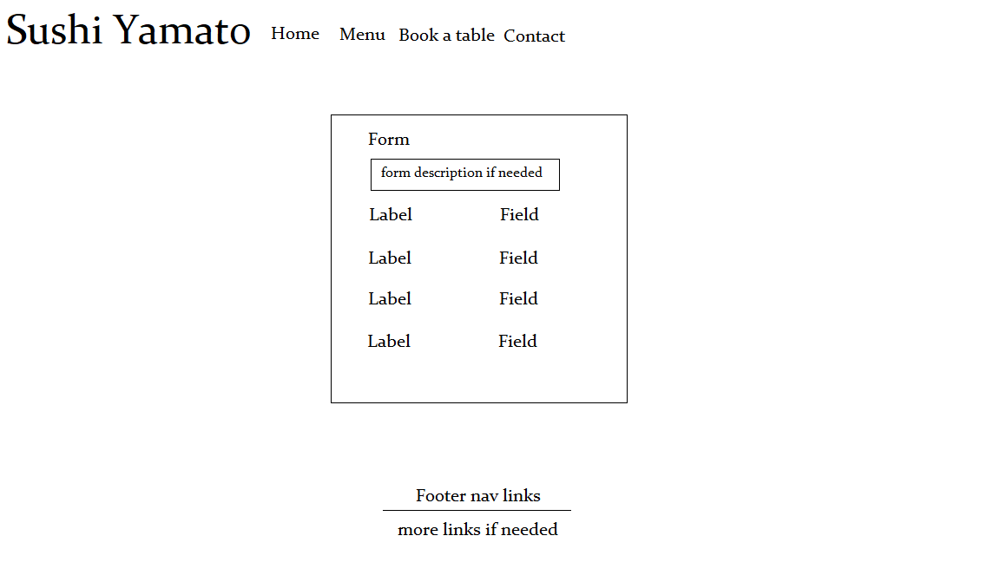

# Sushi Yamato

Sushi Yamato is a Sushi restaurant, which accepts bookings, and booking handling. Editing and viewing the menu.

# Features

## Menu

- Here customers can view the menu without authentication.

- The lists is sorted with the diffrent meals and beverages available.

- Can see the price. 

- Can see the description of the diffrent meals/beverages.

- The menu adopts to diffrent screen sizes.

- Menu for employees
    
    - An employee can sign in and wiew the separate view with the menu only available to employees.

    - The employee is able to add, edit or delete menu items

      

## Booking

- On the booking page the customers is able to book a table. 

- If there are no tables available the user is notified directly when choosing time, date or tablesize and the submit button is disabled.

- If there are no tables available and the customer has turned of javascript the booking won't go through and a message will appear.

- When the booking is saved the customer gets a notification with a booking number.

- The customer can with the booking number edit the booking or entirely delete it.

- Booking for employees

    - An employee can sign in and view the separate view with bookings only available to employees. Here the employee can view all the bookings that has been saved.

    - The employee is able to add, edit or delete booking

    

## Contact page

- The customer can find both phone number and email adress.

- The customer can take part of a map that show exactly where the restaurant is located.

## Accounts

- It is possible to create accounts for everyone.

- If the administrator hasn't added the user account to a specific group or added the right permissions, the user won't be able to see the employee features.

# Testing

- I have tested the application on mobile and also in diffrent browsers to make sure everything is displayed correctly and that every button works as expected.

- All the automated tests description is located [here](/README-TESTS.md).

## Solved Bugs

When deploying the application to heroku there were multiple bugs that arose.

- First the application didn't deploy, this was due to a compatability error with the backports.zoneinfo package.
This was fixed by adding “backports.zoneinfo==0.2.1;python_version<"3.9" in the requirements.txt instead of “backports.zoneinfo==0.2.1"

- The hero image didn't display, this was due to i didn't know that heroku don't host normal images. 
I could fix this by either installing a package that is called whitenoise or host the image on cloudinary.
I chose cloudinary as i had already made a connection to cloudinary with everything else, but the image was hardcoded into the source tag in the CSS.

- The booking page didn't work when deployed at first. The error message was "Access forbidden 400", this was due to that the JS was comming from cloudinary and that wasn't allowed. This was fixed by adding the small amount of JS directly in to the html file.

## Remaining Bugs

- There are no known bugs remaining.

# Validator Testing

### **HTML**

No errors when passing through the official W3C validator that isnt caused by django template variables.

### **CSS**

No errors when passing through [the official W3C validator](https://jigsaw.w3.org/css-validator/validator?uri=https%3A%2F%2Fsushi-yamato.herokuapp.com%2F&profile=css3svg&usermedium=all&warning=1&vextwarning=&lang=sv) that isn't bootstrap.

### **JS**

No errors when passing through the [JShint](https://jshint.com/) validator.
4 warnings are returned:
-   'arrow function syntax (=>)' is only available in ES6 (use 'esversion: 6').
-	'arrow function syntax (=>)' is only available in ES6 (use 'esversion: 6').
-	'async functions' is only available in ES8 (use 'esversion: 8').
-	'const' is available in ES6 (use 'esversion: 6') or Mozilla JS extensions (use moz).

### **Python**

No errors when passing through the PEP8 validator.

There are some warnings left in the settings file, this is due to lines being to long but can't be broken up.

# Deployment

To deploy the project to heroku, do the following

1. Create a app in heroku.
2. Under Resources in your app go click on "Find more add-ons".
3. Add "Heroku Postgres" to the application.
4. Click on the "Heroku Postgres" add-on in your project.
5. Go in under settings and copy the URI and save it somewhere temporarily
6. Login to Cloudinary or create a Cloudinary account.
7. Go to the Cloudinary dashboard. Copy the API "Environment variable" and save it somewhere temporarily.
8. In your Heroku app, go in to settings and click on "Reveal Config Vars"
9. Click on "Add", in the key field write "CLOUDINARY_URL" and in the value field enter the "Environment variable" from cloudinary that was saved from before
and delete the "CLOUDINARY_URL=" part. 
10. Click on "Add", in the key field write "DATABASE_URL" and in the value field enter the URI from Postgres that was saved from before
11. Click on "Add", in the key field write "SECRET_KEY" and in the value field enter a custom key. I used [this](https://djecrety.ir/) site to make mine.

Now all the settings is done on heroku. If you'r site is on Github, in the Heroku app go in to "Deploy" and connect your github account and project.
Lastly scroll down and click on "Deploy Branch" and make sure "main" is selected.

To continue to develop the site you must set up de development environment. 
To do this, create a new file named env.py in the projects root directory in the development environment. Make sure this file is not on github and in your gitignore file.
In the env.py file import os, and write the code as stated below.

"import os

os.environ["DATABASE_URL"] = THE_POSTGRES_KEY FROM BEFORE

os.environ["SECRET_KEY"] = THE_SECRET_KEY

os.environ["CLOUDINARY_URL"] = THE_CLOUDINARY_KEY_WITHOUT_THE_CLOUDINARY_URL=_part."

# UX design work

The designs were made with simpicity in mind. I designed these 2 wireframes in paint to have a get a visual on my vision in mind.

These were the images:

# Model designs 

These were the models i had in mind when creating the project.

- Booking-model: 
    - Firstname
    - Lastname
    - Phone
    - Booking number
    - Tablesize
    - Date
    - Time

menu-models:
- FoodItem 
    - Name
    - Description
    - Price
    - Type
- DrinkItem 
    - Name
    - Description
    - Price
    - Type

At first i didn't remember that the menu models must have a slugfield to make sure the items are accessable with urls Halfway through the project i noticed that the 2 menu models could be the same model. With this i merged the 2 together and made a single model named MenuItems. After this the model now looks like this:

- MenuItem 
    - Name
    - slug
    - Description
    - Price
    - Type

# Credits

- The solution to the deployment bug on Heroku is found [here](https://stackoverflow.com/questions/71712258/error-could-not-build-wheels-for-backports-zoneinfo-which-is-required-to-insta)
- Inspiration to the unique ids for the booking numbers is found [here](https://gist.github.com/mushonnip/0423a2288979d48b772f67835c3e5236)
- How to connect the JS to the backend was found [here](https://russ1487.medium.com/connecting-a-javascript-front-end-to-a-python-django-back-end-c96bcfa0b70c)
- How to Use an HTML5 Date Input With Django Forms was found [here](https://www.youtube.com/watch?v=I2-JYxnSiB0)
- The Hero image was found [here](https://unsplash.com/photos/iOHJKJqO6E0)
- The sushi rolls description was found [here](https://en.wikipedia.org/wiki/Sushi)
- The coffee description was found [here]( https://www.webstaurantstore.com/article/397/types-of-coffee-drinks.html)
- The Zoom effect comes from the Love Running project from [Code Institute](https://codeinstitute.net/)

